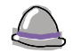
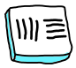

# uses
Inspired by https://uses.tech/

## Editor + Terminal

- VSCodium is my current editor. I made the switch to Visual Studio Code from Atom in 2018, and made the conscious choice to swap to the version with telemetry removed. Before that I used Brackets, Coda and Sublime Text. I wrote my first lines of code with Notepad++ in 2005.
- Default theme
- I keep my VS code extensions in a separate public gist. 
- I use iTerm2 for my terminal. I change the font to Fira Code, and font-size to 14.
- I use Zsh as my shell, with the default theme.

## Desktop Apps

- I am a recent Alfred convert, and paid for the upgrade.
- I use Notion for my todos and notes. I used to iaWriter, or evernote.
- Designs in Sketch
- I use Carbon Copy Cloner for backups and setups

## Design Apps

## Music Apps

 

## Hardware

